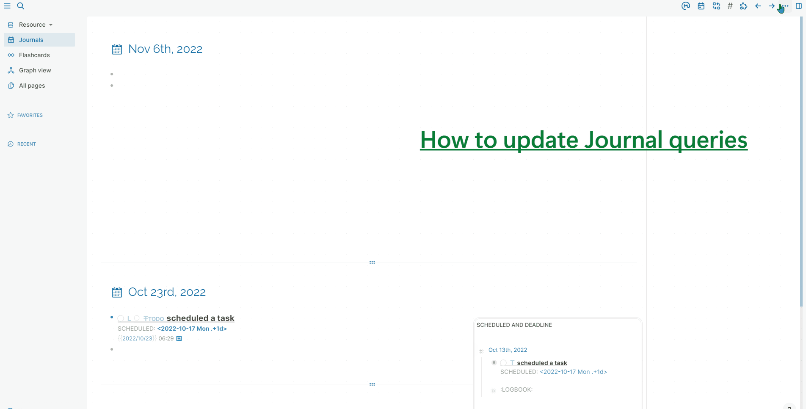

# logseq-plugin-column-layout

- Journals, linked references, and journal queries can be placed side by side.

> ⚠️Cancel if the screen width is less than `1850px`

## Changelog
> page-tags and hierarchy display function in content page (non-journals) separate as a plugin [page-tags and hierarchy](https://github.com/YU000jp/logseq-page-tags-and-hierarchy)

## Supported plugins

> [Awesome UI](https://github.com/yoyurec/logseq-awesome-ui)
> [Awesome Links](https://github.com/yoyurec/logseq-awesome-links)

## Unsupported plugin

> [Awesome Styler](https://github.com/yoyurec/logseq-awesome-styler)

## Screenshot

## What can do

### Journals

- If you use the reference function and write the timeline, it is also effective as a log.
- Press ⌨️`cmd(win) + alt` at the same time to get the reference by mouse dragging on the bullet.

### Linked reference

#### Suitable for [Omnivore plugin](https://github.com/omnivore-app/logseq-omnivore)

- Omnivore is a **WebClipping tool** that can be quoted to Logseq.
- You can see the table of web clips for the day next to the journal, so it's easy to access. (View `substack.com` newsletter)

#### 📅 As a list for inclusion in the next journal

- Use [datenlp plugin](https://github.com/hkgnp/logseq-datenlp-plugin). Add `@wednesday` or read past journals and add `@today`. They become links.

#### PDF highlights
- Logseq has the ability to read and highlight PDF file. If you add a date link to highlights, it will be included in the list of linked references.
- [PDF highlights (docs.logseq.com)](https://docs.logseq.com/#/page/pdf%20highlights)

### Journal queries

- To get more task management
- On Logseq, edit `config.edn` file. [For more details refer to this link(sample code)](https://github.com/YU000jp/logseq-default-queries-journals)

### 🖱️ Right-click on the bullet

#### Context menu 🔁`repeat-task as LATER`

- [Problem] Repeat task is for a notification. Not for journaling.

- [Solution] To place in the journal as a LATER task and block reference. For marking "DONE". 

- [Usage] A block open into right sidebar. Drag that bullet and place it in the journal. After executing the task, click the repeat-task checkbox first, then the LATER task checkbox.

- [Result] Keep repeat task as a recode in journals.

#### Context menu `Copy block reference and embed`

- [Problem] no link in embed

- [Solution] insert block reference and embed together

- [Usage] Copy to clipboard

- [Result] Enables access to reference source

#### Context menu `Make to next line blank`

- [Problem] For blocks with content, line breaks can be annoying.

- [Solution] Select in context menu and work

- [Usage] Open context menu at the bullet for above block

- [Result] Create a line break without breaking outlines

### Original right sidebar

- Pages can be placed side by side in right sidebar.
- Adjust the size by selecting the bottom right of the block. But don't make it too small.
- Changed not to display page-tags and Hierarchy in right sidebar.
- Display several pages side by side in right sidebar.

## ⚠️ Remarks

- Linked References space is blank if there are no tasks in Logseq.
- Linked reference from journal are limited to dates other than today.
- If you find it difficult to see the image in a reduced view, please use the zoom function or open it in sidebar.

## 🚧 Troubleshoot

- Please let me know on [GitHub](https://github.com/YU000jp/Logseq-column-Layout/issues).
- It would be helpful if you could take a screenshot.

## Test Function

### Dialog for automatic markdown link

- [Problem] URL is converted inadvertently / Garbled characters occur.

- [Solution] Confirm in dialog / anti-garbled japanese website : 日本語ウェブサイトの文字化け対策済み

- [Usage] Paste URL, then press Enter to bring up a dialog.

### DONE dialog for add a completed property

- [Problem] Logseq does not record the DONE date.

- [Solution] After the task DONE, add completed property to the block.

- [Usage] After DONE a task, a dialog will appear asking if you want to add a completed property.

- [Result] The date contained in the completed property acts as a link. View completed tasks in Journal Linked References.

### Year List Calendar <slash command : `create Year List Calendar`>

- Using Year List Calendar, all the dates for a full year are generated as date links. When written as child elements, they are displayed in the Linked References section.

## Other my plugins

- [panel coloring](https://github.com/YU000jp/logseq-plugin-panel-coloring)

- [page-tags and hierarchy](https://github.com/YU000jp/logseq-page-tags-and-hierarchy)

## Credit

- [task completion tracker plugin](https://github.com/DimitryDushkin/logseq-plugin-task-check-date)
- [automatic-url-title](https://github.com/0x7b1/logseq-plugin-automatic-url-title)
- [Vertical Panels for Sidebar](https://github.com/r-hegde/logseq-vertical-panels)

---

